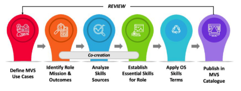

# MVS Co-creation Approach

## Methodology to co-create a MVS Profile

The process followed by Skills4EOSC is a straightforward collaborative authoring and publication process, outlined below as a guide for others interested in applying the approach.

### Define MVS use cases
The use cases may vary according to the role(s) the MVS are to be developed for, and the intended users of the MVS (e.g., trainers or managers of the roles).

### Identify the role’s expected mission and outcomes
For Skills4EOSC, the mission and outcomes relate to Open Science and are expressed in very generic terms. They may also be specified at a more granular level to fit national, regional, sectoral, domain or other organisational requirements.

### Analyse skills sources to identify role activities and competences
The MVS design provides a model defining elements and properties (Appendix A in the Annex to the report). These elements provide a minimal classification scheme for analysis literature sources. The Skills4EOSC bibliography 15 is available for reuse and includes competence frameworks, reports on skill requirements and related literature. For other roles, it may also be helpful to collect and review job descriptions, e. g. if there is insufficient recent literature available to describe skills requirements for the role in question.

### Establish ‘essential skills’ needed to deliver intended outcomes 
Skills4EOSC established an editorial group to draft each MVS, where possible including at least one author who expects to use the MVS in their practice as a trainer or curriculum developer. Successive drafts were reviewed and critiqued, with each iteration broadening the range of actors whose comments were sought. The first target group were intended users of the MVS, in each case a different group of course and curriculum developers within Skills4EOSC Work Packages. The next targets were selected ‘critical friends’ among stakeholders we anticipated would be interested in contributing. Several MVS were also shared publicly, as described below in the next section.

### Summarise the MVS using Open Science Skills Terms
Adding classification terms from an Open Science Skills taxonomy, plus standard metadata terms applicable to learning resources, will contribute to the MVS becoming a FAIR resource, i. e. Findable and Reusable by its intended audience.

Applying the taxonomy terms is a straightforward process involving the following steps:

1. Identify which bullet-point statements the terms are to be applied to. This should be the ‘essential skills and competences’ in the MVS. Optionally the ‘activities’ these relate to can be included, e.g. If they may clarify which terms apply.
2. For each statement, select up to 5 terms from the list and copy them to columns in a table, each column representing one of 5 dimensions of OS Skills (technology, domain, interpersonal, communication, leadership). The relevant terms will probably be spread across more than one of the dimensions.
3. Count the number of terms that have been applied in each column (dimension), and based on their relative frequency classify the skillset’s overall relevance to each dimension as ‘high’, ‘medium’ or ‘low’.
4. Produce a visualisation of the OS skills scope, showing the relevance to each dimension.
5. Compile a table listing the terms selected for each dimension, copy these terms to the MVS Profile, and include links to the definitions given in the terminology sources (t4FS, or CSCCE Glossary).
6. Review the selected terms against the MVS Profile ‘essential skills and competences’ statements to consider rewording them, e.g. if selected terms are only implicit and can be made explicit.

F. Publish in MVS catalogue
The MVS Catalogue is currently a document collection in the Zenodo repository, maintained by the Skills4EOSC project. We encourage interested groups to submit MVS for additional roles (or variations of those already published). Skills4EOSC will add to the collection following a lightweight editorial check that the text fulfils the following criteria.

- Content accurately reflects one or more dimensions of the OS definition applied by the EC to its Horizon Europe programme
- Written using clear language,
- Coherently structured content for all elements of the MVS,
- Sufficient context for the reader to identify the type of organisation or
research community the MVS is applicable to,
- Contains a reference list of relevant sources used,
- Has been been reviewed by a user group e.g. trainers or curriculum developers, and considered suitable for the intended use case(s).

> This Git book is based on the instructions provided in [@filiposka_2023_10063110].

## List of OS Skills Terms

=== "t4FS"
    t4FS: 84 (of 223 in total) 'data stewardship activity' terms, selected for relevance and appropriate level of granularity, mainly from 2nd level of t4FS hierarchy; sorted alphabetically here; italicised terms have been reworded for clarity.

    - Access control & authorisation management
    - Assessment on FAIR data criteria
    - Audit and evaluation
    - Change management
    - Cloud environment management
    - Community building
    - Creativity
    - Crediting research contributors
    - Data access risk assessment and mitigation
    - Data acquisition
    - Data analysis 
    - Data anonymisation and de-identification
    - Data archiving
    - Data categorisation
    - Data citation
    - Data costs management 
    - Data curation
    - Data destruction
    - Data discovery 
    - Data driven decision management
    - Data exploration
    - Data governance
    - Data harmonization
    - Data ingestion
    - Data integration
    - Data mining
    - Data modeling
    - Data policy
    - Data processing
    - Data production
    - Data profiling
    - Data quality assessment
    - Data quality assessment & review
    - Data recovery
    - Data registration
    - Data repository management
    - Data rescue
    - Data scaling
    - Data selection
    - Data sharing and publication
    - Data stewardship coordination
    - Data transformation
    - Data validation and cleaning
    - Data wrangling
    - Depositing in repository
    - Digital archiving
    - Digital format and media migration
    - Digital scholarship
    - Digitisation
    - knowledge to contextualise fair principles to domain
    - Ethical application of patents, licenses
    - Evaluating repositories for data deposit/sharing
    - Identity management
    - Information governance
    - Information security
    - Interface testing
    - Meeting/conference organisation
    - Mentoring on open and fair methods
    - Metadata catalog management
    - Metadata creation
    - Metadata exposure
    - Open access publishing
    - Open innovation
    - Open peer review
    - Persistent identifiers management
    - Preservation 
    - Preservation costs management
    - Privacy governance
    - Programme governance
    - Project management
    - Provenance information management
    - Research governance
    - Research integrity process design
    - Research integrity, attribution, impact awareness
    - Research management
    - Resource management 
    - Securing networks for data integrity
    - Securing sustainable funding
    - Selecting appropriate data handling methods
    - Service level management
    - Software preservation
    - Stakeholder engagement on societal impact
    - Storage management
    - Strategic/long-term planning
    - Training in open and fair methods
    - User acceptance testing

=== "CSCCE"
    CSCCE  Glossary: 45 terms listed according to 5 dimensions, selecting those included in 'skills wheel' for scientific community managers

    - Interpersonal
        - Engagement
        - Collaboration
        - Teaching and training
        - Networking
        - Mentoring
        - Moderation, mediation and intervention
        - Emotional integration
        - Cultural competence
        - Consultation and listening
    - Program management (= Leadership)
        - Operational planning and implementation
        - Time management
        - Record-keeping
        - Project Reporting
        - Evaluation and assessment
        - Event planning
        - Financial management
        - Community governance
        - Meeting facilitation
    - Program development (= Domain)
        - Strategy development
        - Landscape analysis
        - Business Modeling
        - Proposal development
        - Advancement, growth and sustainability
        - Advocacy
        - Project/programme design
        - Change management
        - Recruitment, welcoming and onboarding
    - Communication
        - Content planning
        - Content creation and curation
        - Copywriting and editing
        - Marketing and branding
        - Knowledge brokering
        - Media relations
        - Outreach
        - Speaking and presenting
        - Social media
    - Technical 
        - Media production
        - Data analysis
        - Data visualization
        - Data management
        - Systems administration and maintenance
        - Product management of technology platforms
        - Web and UI design
        - Content Management System (CMS) administration
        - Technical support

=== "ResearchComp"
    [ResearchComp](https://research-and-innovation.ec.europa.eu/system/files/2023-04/ec_rtd_research-competence-presentation.pdf)

    **Cognitive abilities**

        1.  Abstract thinking
        2.  Critical thinking
        3.  Analytical thinking
        4.  Strategic thinking
        5.  Systemic thinking
        6.  Problem solving
        7.  Creativity
    
    **Self management**

        8.  Manage personal professional development
        9.  Show entrepreneurial spirit
        10.  Plan self-organisation
        11.  Cope with pressure
    
    **Working with others**

        12.  Interact professionally
        13.  Develop networks
        14.  Work in teams
        15.  Ensure wellbeing at work
        16.  Build mentor-mentee relationships
        17.  Promote inclusion & diversity
    
    **Doing research**

        18.  Disciplinary expertise
        19.  Perform scientific research
        20.  Conduct interdisciplinary research
        21.  Write research documents
        22.  Apply research ethics and integrity principles
    
    **Managing research**

        23.  Mobilise resources
        24.  Manage projects
        25.  Negotiate
        26.  Evaluate research
        27.  Promote open access publishing
    
    **Managing research tools**

        28.  Manage research data
        29.  Promote citizen science
        30.  Manage intellectual property rights
        31.  Operate open source software
    
    **Making an Impact**

        32.  Participate in publication process
        33.  Disseminate results to the research community
        34.  Teach in academic or vocational context
        35.  Communicate to the broad public
        36.  Promote the transfer of knowledge
        37.  Increase the impact of science on policy and society
        38.  Promote open innovation
