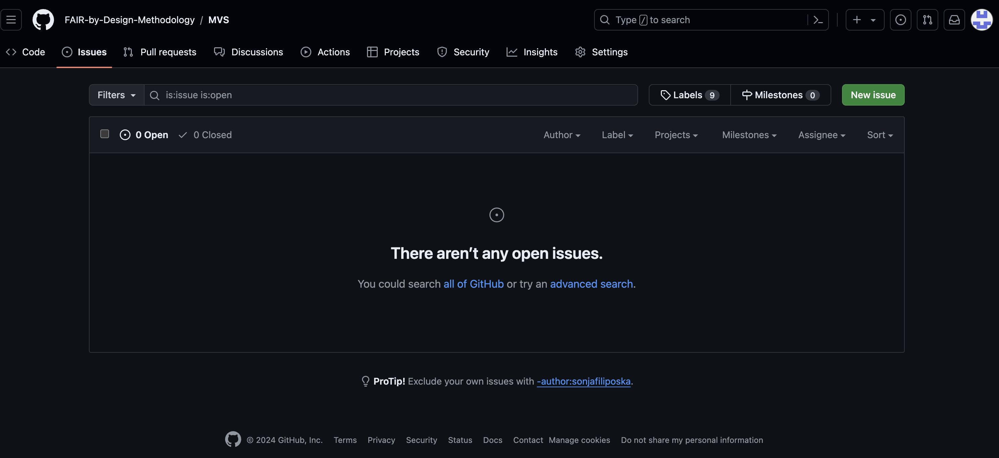
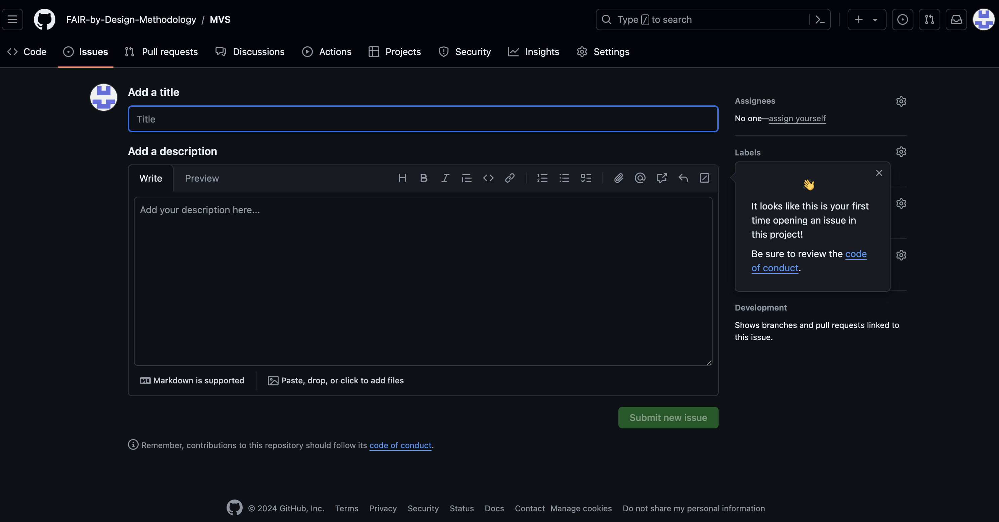
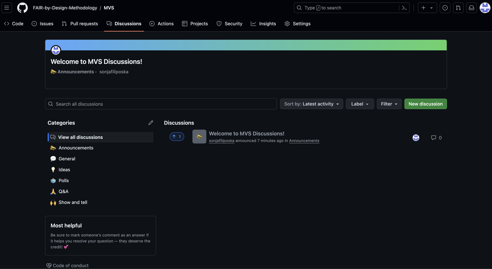
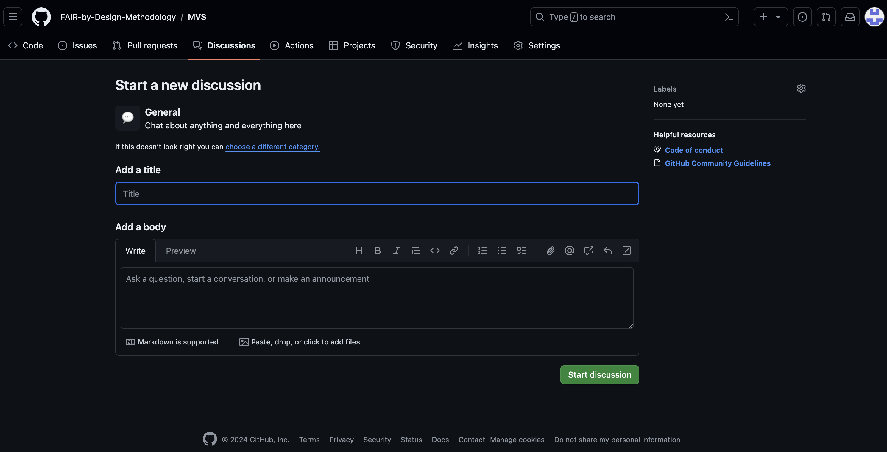

# How to contribute to the development of the MVS profiles

The MVS profiles are built using a GitHub open collaboration environment that can be used by any external party to provide comments using several different means.

If you would like to contribute with comments, suggestion or maybe concrete additions/changes to the MVS profiles please choose one of the contribution methods described below:

## GitHub Issues

Anyone can browse and view the content of the [MVS repository](https://github.com/FAIR-by-Design-Methodology/MVS). This also enables interested external parties to reuse the MVS materials, but also analyse them in great detail. 

Anyone that goes to the MVS repository can use the Issues feature to provide comments or suggestions using the following steps:

1. Go to the [MVS repository on GitHub](https://github.com/FAIR-by-Design-Methodology/MVS)
2. Choose Issues and then click on the "New issue" green button to create a new issue where a change can be suggested.

3. Provide a Title and add a description of the issue
4. Click on "submit new issue"
5. The repository managers will be automatically notified that a new issue has been created

## GitHub Discussions

If you don't have any specific suggestions but would like to get in touch with the MVS team and discuss the MVS catalogue then you can use the Discussions feature:

1. Go to the [MVS repository on GitHub](https://github.com/FAIR-by-Design-Methodology/MVS)
2. Choose Discussions and then click on the "New discussion" green button to start a new discussion
3. Choose the type of discussion that best serves your needs and click "get started"

4. Provide a Title and add a body for the message
4. Click on "start discussion"
5. The repository managers will be automatically notified that a new discussion message has been created

